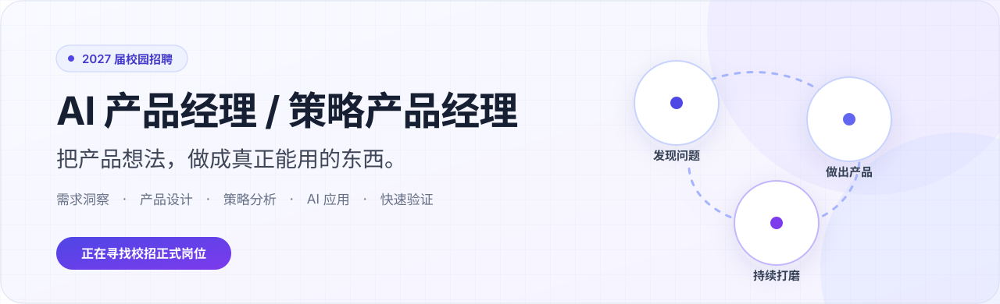
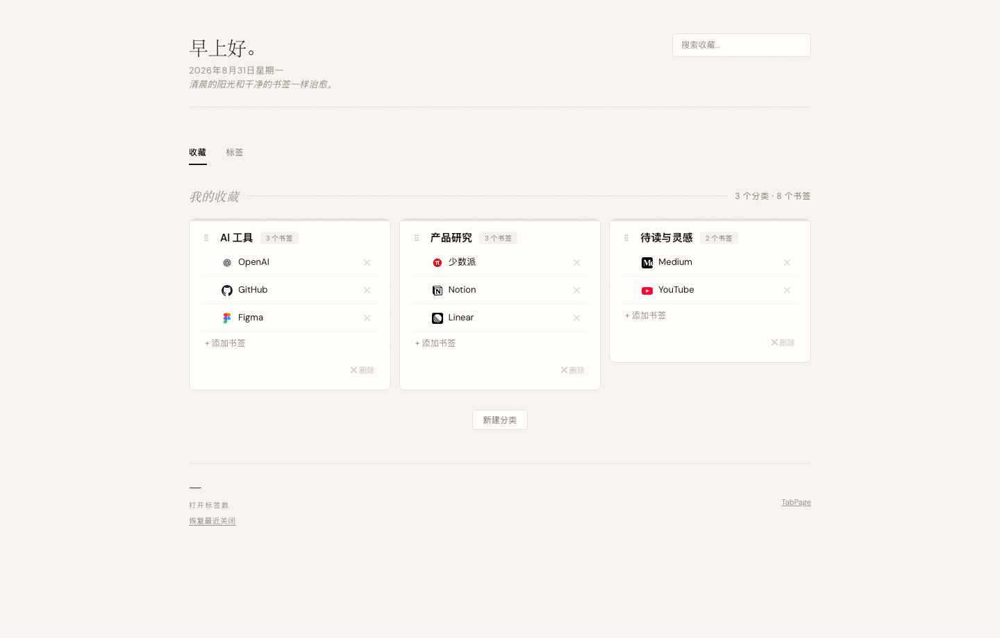

  

  你好！我是一名 2027 届应届生，目前正在寻找 <strong>AI 产品经理 / 策略产品经理</strong>方向的校招机会。

  我习惯从日常使用中捕捉那些不够顺手的细节，也更相信把想法做出来，比停留在方案里更重要。 
  在没有现成开发资源时，我会借助 AI 把问题变成真正能用的产品，再在持续使用中一点点把它打磨好。

  <a href="mailto:riwonswain@163.com"><strong>riwonswain@163.com</strong></a>

---

## 能力与工具

<table>
  <tr>
    <td width="56%" valign="top">
      <strong>产品能力</strong>  
      需求洞察　·　产品设计　·　策略分析　·　AI 应用　·　快速验证
    </td>
    <td width="44%" valign="top">
      <strong>常用工具</strong>  
      SQL　·　Figma　·　Axure　·　Python
    </td>
  </tr>
</table>

## 精选项目

<table>
  <tr>
    <td width="55%" valign="top">
      
    </td>
    <td width="45%" valign="top">
      <h3>OfferLoop</h3>
      
<strong>让每一次求职行动，都为下一步积累。</strong>

      
由 7 个 Agent Skill 与飞书工作区组成的开源 AI 求职系统，连接招聘机会、求职进展、经历深挖、定制简历、面试准备与复盘。

      
我希望解决求职信息和材料散落、每次使用 AI 都要重新解释背景的问题。项目覆盖了问题定义、产品流程设计、功能实现、测试和公开发布。

      

        <a href="https://github.com/riwonswain-ovo/OfferLoop"><strong>查看代码</strong></a>
       　·　
        <a href="https://offerloop-website.vercel.app"><strong>产品官网</strong></a>
      

    </td>
  </tr>
</table>

 

<table>
  <tr>
    <td width="45%" valign="top">
      <h3>TabPage</h3>
      
<strong>让收藏、标签页和待读清单回到同一个入口。</strong>

      
我发现浏览器收藏与已打开的标签页长期分散管理：收藏难找，页面又容易重复打开。因此，我在 Tab Out 的基础上继续进行产品设计与功能增强。

      
TabPage 增加了收藏分类、拖拽排序、跨窗口标签切换、重复标签检测，以及收藏与标签页之间的互通。

      
<a href="https://github.com/riwonswain-ovo/tabpage-chrome-extension"><strong>查看项目</strong></a>

    </td>
    <td width="55%" valign="top">
      
    </td>
  </tr>
</table>

---

  <strong>正在寻找 2027 届 AI 产品经理 / 策略产品经理校招正式岗位</strong>  
  如果你对我的项目或经历感兴趣，欢迎通过
  <a href="mailto:riwonswain@163.com">riwonswain@163.com</a>
  联系我。

